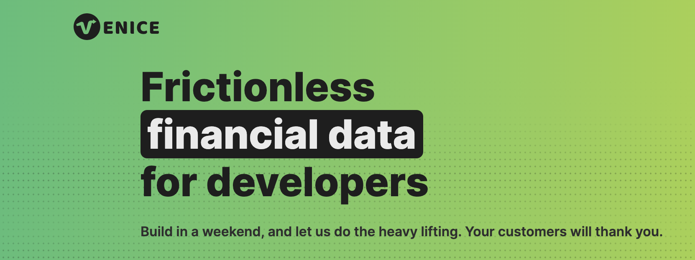

# Venice Typescript Library

[](https://www.npmjs.com/package/@fern-api/venice)

The Venice Typescript library provides access to the Venice API from JavaScript/TypeScript.

## Usage

[](https://stackblitz.com/edit/typescript-example-using-sdk-built-with-fern-uyldqq?file=package.json,app.ts,node_modules%2F%40fern-api%2Fvenice%2Fapi%2Fresources%2Finstitution%2Fclient%2FClient.d.ts,node_modules%2F%40fern-api%2Fvenice%2Fapi%2Fresources%2Ftransaction%2Fclient%2Frequests%2FCreateTransaction.d.ts,node_modules%2F%40fern-api%2Fvenice%2Fapi%2Fresources%2Fcommons%2Ftypes%2FTransaction.d.ts)

```typescript
import { VeniceClient } from '@fern-api/venice';
import { Return } from '@fern-api/venice/api';

void main();

async function main() {
  const client = new VeniceClient({
    environment: 'VeniceApiEnvironment',
  });

  const response = await client.transaction.create({
    prefer: Return.Minimal,
    body: {
      id: 'adXWDW22',
      date: '2023-03-01',
      description: 'description',
      payee: 'payee',
      amountQuantity: 100,
      amountUnit: 'USD',
      accountId: 'accountId',
      externalCategory: 'external category',
      notes: 'notes',
      updatedAt: '2023-03-01',
      createdAt: '2023-03-01',
    },
  });
  console.log('Received response from Venice!', response);
}


```

## Beta status

This SDK is in beta, and there may be breaking changes between versions without a major version update. Therefore, we recommend pinning the package version to a specific version in your package.json file. This way, you can install the same version each time without breaking changes unless you are intentionally looking for the latest version.

## Contributing

While we value open-source contributions to this SDK, this library is generated programmatically. Additions made directly to this library would have to be moved over to our generation code, otherwise they would be overwritten upon the next generated release. Feel free to open a PR as a proof of concept, but know that we will not be able to merge it as-is. We suggest opening an issue first to discuss with us!

On the other hand, contributions to the README are always very welcome!
